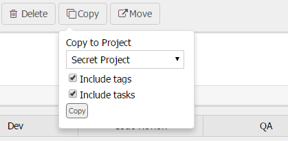

# AgileZen Copy Machine

## What is it? 

A Chrome extension to allow stories to be copied and moved across AgileZen projects.

On story detail pages, Copy and Move buttons are injected into the page. Copying a ticket will clone it, while moving it will clone it and delete the original. Stories can be copied/moved to the same or another project, as well as optionally copying the tags and tasks. 

*This is in no way affiliated with, maintained, sponsored or endorsed by AgileZen or Rally Software.*

## Licensing

[MIT License](LICENSE.md?raw=true)

### Attributions

* "[Font Awesome](http://fontawesome.io)", Dave Gandy, MIT License and SIL OFL 1.1
* "[jQuery](https://jquery.org/)", MIT License
* "[jQuery Dropdown](http://labs.abeautifulsite.net/jquery-dropdown/)", MIT License